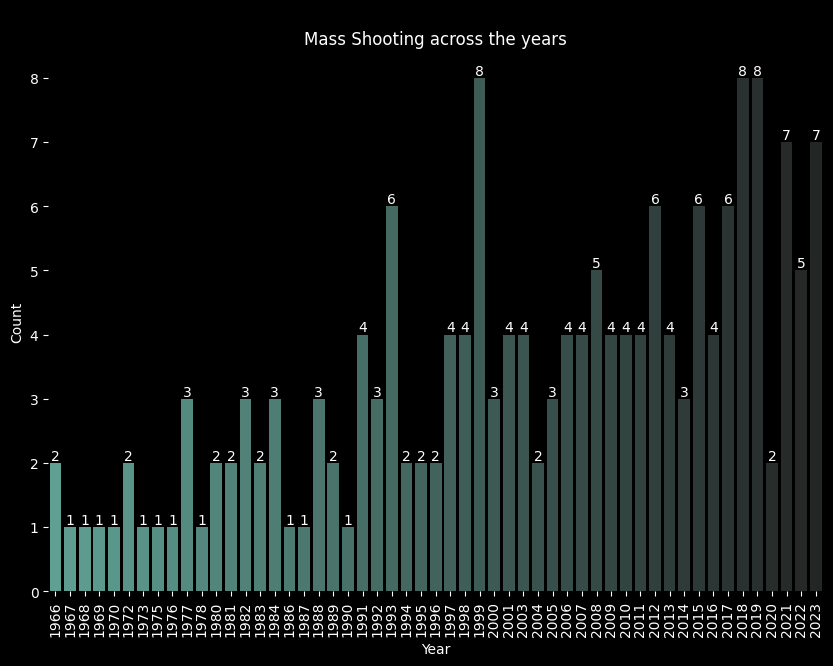
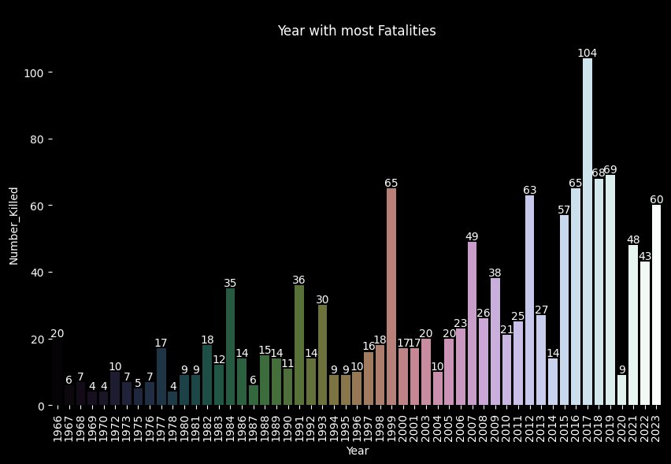
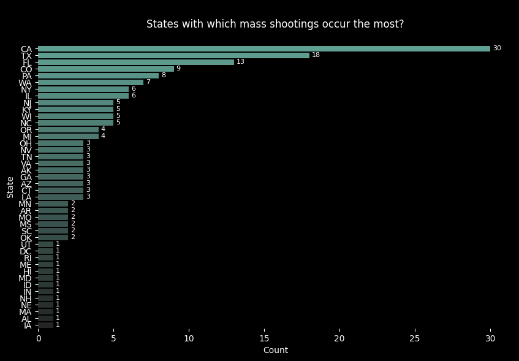
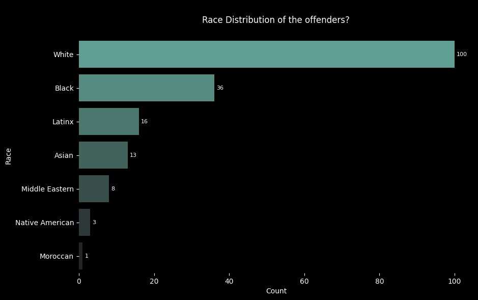
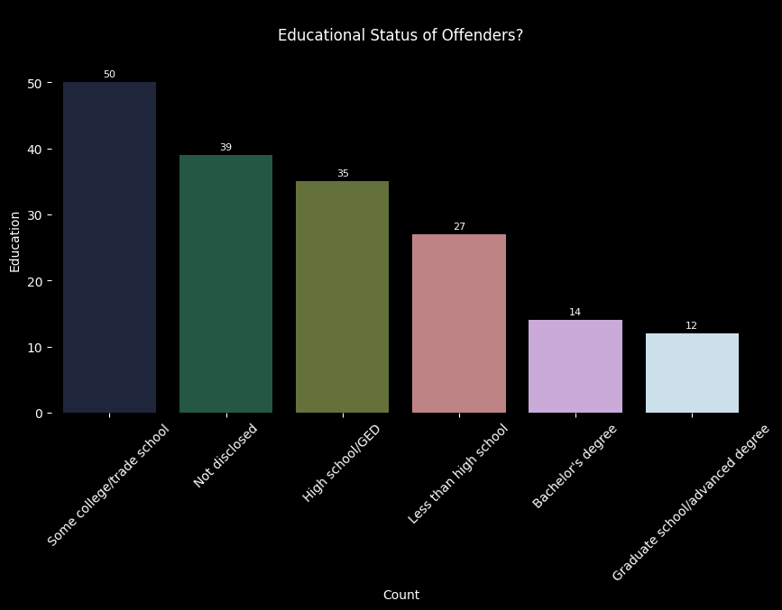
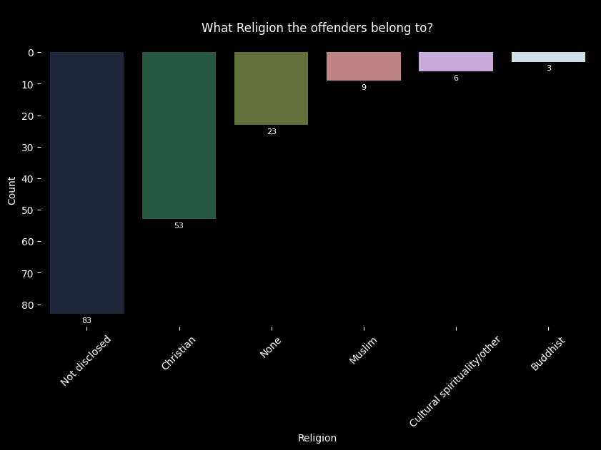
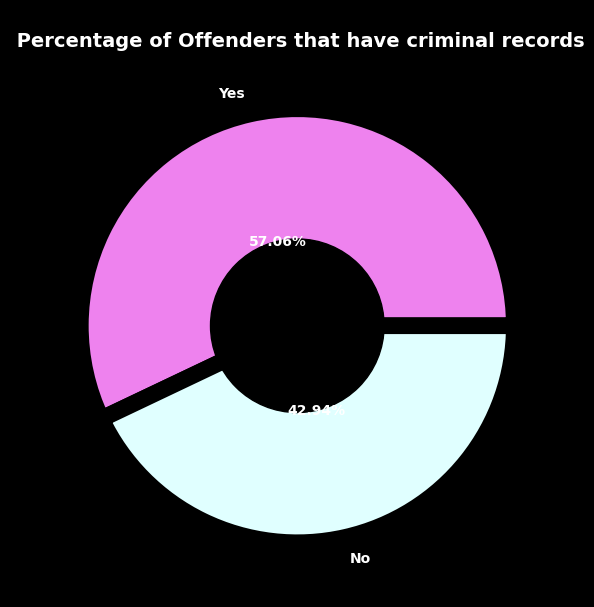
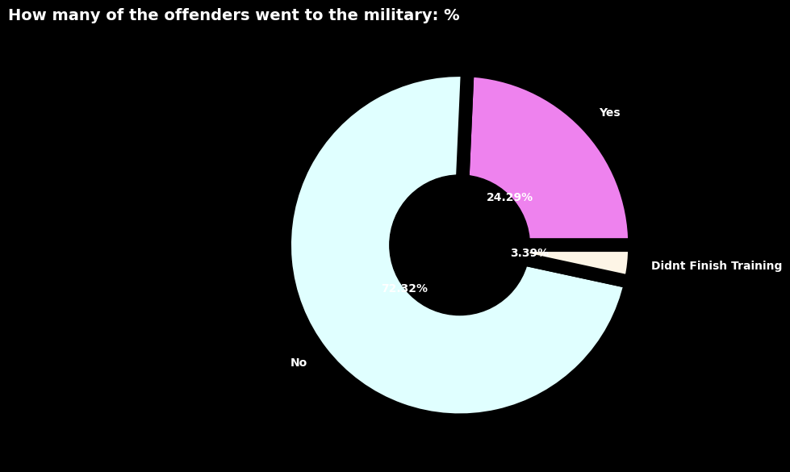
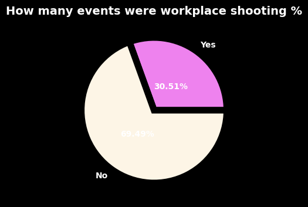
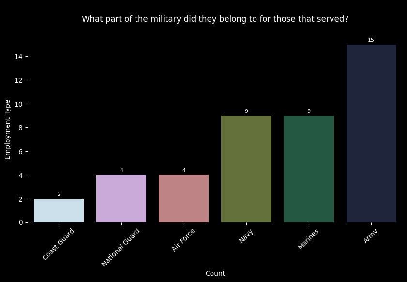

                                    MASS SHOOTING IN THE USA

                    Is Mass Shooting an American phenomenon?
                    According to research found on mass shooting in the USA, it was found that in a 2016 study that one third of world's public mass shooting occurred in the USA. a 2023 report published in JAMA covering 2014 to 2022, found there had been 4011 mass shottings in the USA. Our dataset was sourced from the Violence Project, it does not truly reflect the true nature/ details about mass shootings in the USA. 
    I am hoping to be able to extract more data from sources online so as to be able show the true nature of mass shootings.
        Contributing factor of these incidents
    * Higher accesability and ownership of guns has been citied as a reason for USA's high rate of mass shooting.
    * Social Cultural favtors and perperator life history: A study by Journal of threat assessment and Mangement studies show that mass shooters are more likely to be unemployed and be unmarried in comparison ti the general population, while in comparison to general homicide offenders, mass shooters were likely to not be in an intimate relationship.
        Effects
    *Political: "mass shooting have a trong impact on the emotion of individuals but the impact is politized, limited to individuals living within towns or city where incidents occur and fades within the week". The study authors suggested that this phenonmenon could explain why mass shooting in the US have not led to meaningful policy reforms.
    *Public Health: studies show that 12.4% of mass shoting patients were diagnosd with some form of mental illness, most common bring PTSD.Men show lower rates of developing PTSD unlike women who show higher rate.
This analysis focuses on the data gotten from theviolenceproject.org
            *The mass shooting dataset has about 224 colunms and 200 rows
            *Out of 224 columns, 26 columns were picked to be used for the analysis
            *Columns with missing values less than 10% include : Race, Sexual_Orientation, Victims_Inside_Outside, Military_Service,Mental_illness, Employment_Status
            *Columns with missing values more than 10% : Religion, Education
            *For columns with missing values less than 10%, dropna method was applied to them
            *For columns with missing values more than 10%, the fillna method was applied to them
                    df[['Religion', 'Education']].fillna('Not disclosed', inplace = True)
            *Data types in Criminal_Records, Military_Service, Armed_Person_on_Scene, Workplace_Shooting was changed from integer to string
            *There was no duplicate values found
            *There was no need to format the dates, since it came preformatted
            *After cleaning, the dataset shape is 26,177
                                    Exploratory Analysis
            *Total number of deaths = 1334
            *Total number of people injured = 2156
            *Year with most attacks in recent times 2018 and 2019, followed closely by 2021 and 2023
            
            *Year with most recorded fatalities is 2017 with a count of 104
            
            *Majority of the offenders are in their 20s
            *Majority of these mass shooting incidents happen in califoria
            
            *56.5% of offenders are of the white descent
            
            *28.3% of offenders have some type of college/trade school degree ->i.e they work blue collar jobs
            
            *46.9% of offenders did not disclose any faith
            *29.9% of offenders belong to the christain faith
            
            *57.06% of offenders have criminal records
            
            *Most offenders are not employed
            *24.3% of offenders worked in the military
            
            *30.5% of recorded events happened in the workplace of victims
            
            *For offenders that served in the military, 34.9% served in the military
            

    Policy Solutions to Address Mass Shooting
    *Sensible gun laws : Reduce easy access to dangerous weapons
    *Establish a culture of gun safety
    *Public health soultions : Recognize gun violence as a critical and preventable public health problem.
    *Trauma connections and services : Expand access to high quality, culturally competent coordinated.